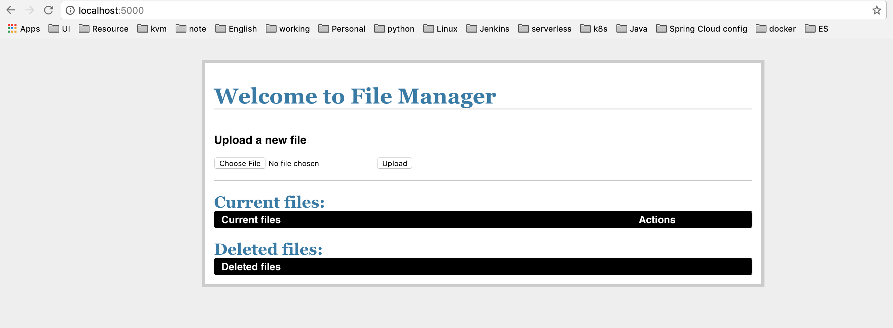
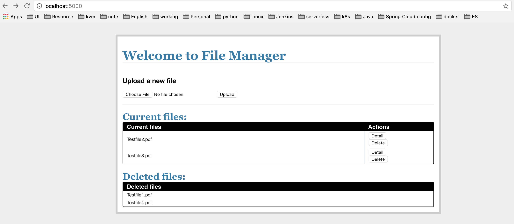

# File manager
This program provides an HTTP API to store and retrieve files.
It support the following features:
- Upload a new file
- Retrieve an uploaded file by name
- Delete an uploaded by name

## How to build / setup the software
Clone the source and run docker build
```
# docker build -t <docker_tag> .
```

Run container:
```commandline
# docker run -d -p 5000:5000 <docker_images>
```

## How to test
After the container run, we could access the program from host's IP address with port 5000


The web support a simple webpage to interact with the API for simple action like: upload, retrieve to view file or delete the uploaded file.

## There are 3 endpoints for the program
- Homepage
```commandline
api.add_resource(Home, '/')
```
- API endpoint to manage files support 
```
api.add_resource(Files, '/files')
```
- API endpoint to manage file
```
api.add_resource(File, '/file/<string:filename>')
```
- Final screenshot with listed current files and also deleted files
